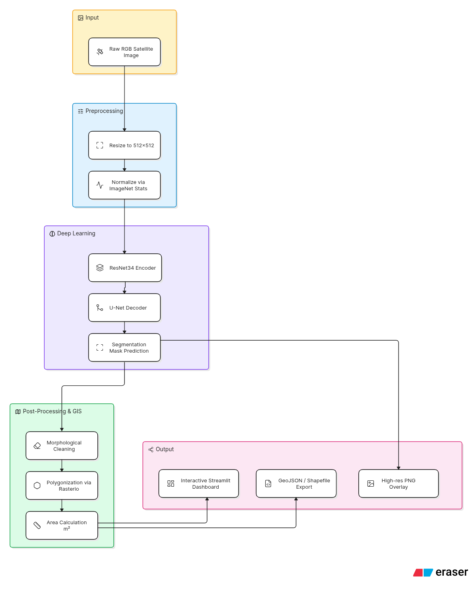

# 🛰️ AeroSeg — Aerial Land Cover Segmentation Pipeline


**AeroSeg** is an end-to-end deep learning pipeline that bridges the gap between machine learning and geospatial analysis. It performs **semantic segmentation on satellite and aerial imagery** to classify land surface types, and automatically exports the segmented regions as **GIS-ready vector polygons** (GeoJSON/Shapefile) complete with precise area measurements.

---

## 🎥 Project Demo

> **Note to recruiters and users:** Click the image below to watch a full video walkthrough of the AeroSeg platform in action, including the interactive dashboard and real-time segmentation.

[](https://www.youtube.com/watch?v=YOUR_VIDEO_ID_HERE)

*(Replace `YOUR_VIDEO_ID_HERE` with your actual YouTube video ID once uploaded)*

---

## 🎯 Why AeroSeg? (For Interviewers & Recruiters)

This project demonstrates a full-stack, production-ready AI solution rather than just a standalone Jupyter Notebook. It highlights several key engineering competencies:

1. **Applied Deep Learning**: Implements a highly effective **U-Net** architecture with a **ResNet34** encoder, utilizing pre-trained ImageNet weights for robust feature extraction.
2. **Geospatial Processing (GIS)**: Goes beyond standard computer vision by converting raw raster masks into georeferenced vector polygons (`rasterio.features.shapes`), calculating actual surface areas in square meters.
3. **MLOps & Pipeline Design**: Features a highly modular codebase with separate, scalable scripts for data preparation, training, evaluation, and inference.
4. **Interactive Dashboard**: Provides a sleek, modern UI built with **Streamlit** (featuring custom HTML/CSS dashboards) that allows non-technical users to upload images, tweak transparency, filter classes, and instantly download GIS data.
5. **Production Best Practices**: Includes automated environment setup, YAML-based configuration (`config.yaml`), and efficient mixed-precision GPU training.

---

## 🧠 System Architecture

AeroSeg's pipeline is designed for scalability and clear separation of concerns.



---

## 🌍 Land Cover Classes

The model is trained to recognize the following distinct environmental and urban classes:

| Class | RGB in Mask | Index | Description |
|---|---|---|---|
| **Urban / Impervious** | `(0, 255, 255)` | 0 | Buildings, roads, parking lots, artificial structures |
| **Agriculture** | `(255, 255, 0)` | 1 | Farms, plantations, cultivated land |
| **Rangeland** | `(255, 0, 255)` | 2 | Open terrain, scrublands, non-forest vegetation |
| **Forest / Vegetation** | `(0, 255, 0)` | 3 | Dense tree canopies, woods, forests |
| **Water** | `(0, 0, 255)` | 4 | Rivers, lakes, oceans, pools |
| **Barren Land** | `(255, 255, 255)` | 5 | Exposed soil, sand, rocks, sparse vegetation |

---

## 🚀 Quickstart Guide

### 1. Environment Setup

```bash
# Clone the repository
git clone <repo-url>
cd aeroseg

# Create and activate virtual environment
python3 -m venv venv
source venv/bin/activate  # On Windows: venv\Scripts\activate

# Install dependencies
pip install -r requirements.txt
```

### 2. Dataset Preparation

This project natively supports the **DeepGlobe Land Cover Classification Challenge** dataset.
1. Download the dataset from [Kaggle](https://www.kaggle.com/datasets/balraj98/deepglobe-land-cover-classification-dataset).
2. Unzip it directly into the `data/raw/` directory.
3. Run the automated preparation script to resize, normalize, and split the data (80/10/10 Train/Val/Test):

```bash
python data_prep.py --config config.yaml
```

### 3. Model Training (Optional)

> **Note**: Pre-trained model weights are included in the `checkpoints/` directory, so you do not need to train the model yourself to try it out! You can skip directly to step 4.

If you wish to train the U-Net model from scratch, the training script automatically utilizes CUDA mixed-precision training if a GPU is available, logging metrics to `logs/metrics.csv`.

```bash
python src/train.py --config config.yaml
```

### 4. Interactive Web Dashboard

Launch the Streamlit web application to test the model interactively. The app features sample image loading, dynamic overlay filtering, and direct vector downloads.

```bash
streamlit run app.py
```

---

## 💻 CLI Inference & GeoJSON Export

You can run predictions on standalone images programmatically without launching the web UI.

```bash
python src/predict.py --image path/to/image.jpg --checkpoint checkpoints/best.pth --config config.yaml --output outputs/
```

**Generated Assets:**
- `*_mask.png`: The raw class index mask.
- `*_overlay.png`: A beautifully blended visualization.
- `*_areas.json`: Statistical breakdown of surface areas.
- *Optional via script modifications*: GeoJSON polygon vectors.

### Example GIS Output (GeoJSON)

```json
{
  "type": "FeatureCollection",
  "features": [
    {
      "type": "Feature",
      "properties": {
        "class_id": 3,
        "class_name": "Forest/Vegetation",
        "area_m2": 12543.75
      },
      "geometry": {
        "type": "Polygon",
        "coordinates": [[[10.5, 20.0], [15.0, 20.0], [15.0, 25.5], [10.5, 25.5], [10.5, 20.0]]]
      }
    }
  ]
}
```

---

## 📊 Evaluation & Metrics

The pipeline evaluates model performance using standard geospatial computer vision metrics. The automated evaluation script (`src/evaluate.py`) computes:

* **mIoU (Mean Intersection over Union)**: Primary metric evaluating the spatial overlap accuracy.
* **Dice Coefficient / F1 Score**: Measures harmonic mean of precision and recall.
* **Pixel Accuracy**: Overall pixel correctness across all classes.

```bash
python src/evaluate.py --config config.yaml --split test --checkpoint checkpoints/best.pth
```

---

## 🗂️ Project Structure

```text
aeroseg/
├── data/
│   ├── raw/                 # Unzipped DeepGlobe dataset
│   ├── processed/           # Processed & split tiles (train/val/test)
│   └── samples/             # Sample imagery for dashboard demo
├── checkpoints/             # Saved PyTorch model weights (.pth)
├── src/
│   ├── dataset.py           # DeepGlobe PyTorch Dataset & Albumentations pipeline
│   ├── model.py             # U-Net architecture & initialization
│   ├── train.py             # Training loop, optimizer, and loss functions
│   ├── evaluate.py          # Metric calculation and reporting
│   ├── predict.py           # Single-image inference engine
│   └── gis_export.py        # Raster-to-Vector (GeoJSON) pipeline
├── app.py                   # Streamlit Dashboard UI
├── data_prep.py             # Dataset cleaning and splitting logic
├── config.yaml              # Centralized configuration variables
└── requirements.txt         # Project dependencies
```

---

## 🛠️ Technology Stack

| Category | Technologies Used |
|---|---|
| **Deep Learning** | PyTorch, segmentation-models-pytorch |
| **Computer Vision** | OpenCV, Albumentations |
| **Geospatial / GIS** | Rasterio, GeoPandas, Shapely, Folium |
| **Web Frontend** | Streamlit, Custom HTML/CSS |
| **Data Processing** | NumPy, Pandas |

---

## 📄 License

This project is open-sourced under the MIT License. See [LICENSE](LICENSE) for details.
